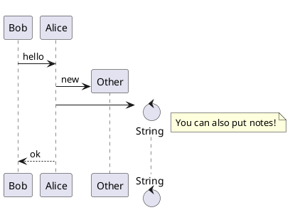

# mogege

[](https://gohugo.io)
[](LICENSE)

### A blog theme for [Hugo](https://gohugo.io).


**This project is based on
[LeaveIt](https://raw.githubusercontent.com/liuzc/LeaveIt/)**

Because the author of
[LeaveIt](https://raw.githubusercontent.com/liuzc/LeaveIt/) seems to have
abandoned this project, but I prefer this theme, so I simply reopened a new
project.

At this stage, I mainly integrate the part I modified with LeaveIt, and will add
more features in the future.

## Features

- Images lazy loading
  ([Can I use?](https://caniuse.com/#search=Lazy%20loading%20via%20attribute%20for%20images%20%26%20iframes))
- Automatically highlighting code (Support by
  [highlight.js](https://highlightjs.org/))
- TeX Functions (Support by [KaTeX](https://katex.org/))
- [PlantUML](https://plantuml.com/en/) (Sequence diagram, Usecase diagram, Class
  diagram ...)
- Dark/Light Mode
- Support for embedded BiliBili video
- Support hidden text ...

Here is a table showing the similarities and differences between [mogege](https://github.com/Mogeko/mogege) and [LeaveIt](https://github.com/liuzc/LeaveIt):

| Features                    | mogege                                                       | LeaveIt |
| --------------------------- | ------------------------------------------------------------ | ------- |
| Categories                  | Yes                                                          | Yes     |
| Tags                        | Yes                                                          | Yes     |
| RSS support                 | Yes                                                          | Yes     |
| sitemap.xml                 | Yes                                                          | Yes     |
| robots.txt                  | Yes                                                          | Yes     |
| Quote                       | Optimization                                                 | Yes     |
| Images lazy loading         | Optimization[*](https://caniuse.com/#search=Lazy%20loading%20via%20attribute%20for%20images%20%26%20iframes) | Yes     |
| Dark/Light Mode             | Optimization                                                 | Yes     |
| Highlighting code           | Optimization                                                 | Yes     |
| Comment area                | Optimization                                                 | Yes     |
| TeX Functions               | Yes                                                          |         |
| PlantUML                    | Yes                                                          |         |
| BiliBili video (shortcodes) | Yes                                                          |         |
| Hidden text (shortcodes)    | Yes                                                          |         |
| Social button               | Yes                                                          | Yes     |
| lightGallery                |                                                              | Yes     |

## Requirements

Hugo 0.68.3 or higher

**Hugo extended version**, read more
[here](https://gohugo.io/news/0.48-relnotes/)

## Installation

Navigate to your hugo project root and run:

```bash
git submodule add https://github.com/Mogeko/mogege themes/mogege
```

Then run hugo (or set `theme: mogege` in configuration file)

```bash
hugo server --minify --theme mogege
```

## Creating site from scratch

Below is example how to create new site from scratch

```bash
hugo new site mydocs; cd mydocs
git init
git submodule add https://github.com/Mogeko/mogege  themes/mogege
cp -R themes/mogege/exampleSite/content .
```

```bash
hugo server --minify --theme mogege
```

## Lazy loading

If your browser is
[supported](https://caniuse.com/#search=Lazy%20loading%20via%20attribute%20for%20images%20%26%20iframes),
we will lazy loading `` and `<iframes>`

Make sure your browser version:

- Chrome > 76
- Firefox > 75

## TeX Functions

**Note:**
[list of TeX functions supported by KaTeX](https://katex.org/docs/supported.html)

To enable KaTex globally set the parameter `math` to `true` in a project's
`config.toml`

To enable KaTex on a per page basis include the parameter `math: true` in
content files.

### Example

```latex
% Inline math:
$$ \varphi = \dfrac{1+\sqrt5}{2}= 1.6180339887… $$

% or
% Block math:
$$
 \varphi = 1+\frac{1} {1+\frac{1} {1+\frac{1} {1+\cdots} } }
$$
```


## PlantUML

**PlantUML is supported by the
[official server](http://www.plantuml.com/plantuml/uml/SyfFKj2rKt3CoKnELR1Io4ZDoSa70000)**

To enable KaTex globally set the parameter `plantuml` to `true` in a project's
`config.toml`

To enable KaTex on a per page basis include the parameter `plantuml: true` in
content files.

You can insert PlantUML in the post by:

<pre>
&#96;&#96;&#96;plantuml
PlantUML syntax
&#96;&#96;&#96;
</pre>

For example:




## Embedded BiliBili video

You can embed BiliBili videos via Shortcodes, just provide the AV 号/BV 号 of
the bilibili video

You can also use the PV 号 to control the 分 P (default: `1`)

```txt

```

Click [here](https://mogeko.github.io/2020/079#biliplayer) for examples

## Hidden text

You can use "hidden text" to hide spoiler content

```txt
 HIDDEN TEXT 
```

Click [here](https://mogeko.github.io/2020/080#spoiler) for examples

## utteranc comment system

This blog supports the 
[utteranc](https://utteranc.es) comment system. 

It is lighter and more powerful than Gitalk.

To use utteranc, you need make sure the 
[utterances app](https://github.com/apps/utterances) is 
installed on the repo, otherwise users will not be able to post comments. 

Then enable utteranc in config.toml

```toml
[params]
    enableUtteranc = true
```

Then Configuration: (For more settings, please refer to 
[HomePage](https://utteranc.es))

```toml
[params.utteranc] # Homepage: https://utteranc.es
    repo = "" # The repo to store comments
    issueTerm = "title" # the mapping between blog posts and GitHub issues. 
    theme = "preferred-color-scheme" # Theme
    crossorigin = "anonymous" # default: anonymous
```

## Gitalk comment system

This blog supports the [gitalk](https://github.com/gitalk/gitalk) comment
system. To use gitalk, you need to apply for a Github Application. For details,
please refer to
[here](https://mogeko.me/2018/024/#%E5%88%9B%E5%BB%BA-github-application).

Then enable gitalk in config.toml

```toml
[params]
    enableGitalk = true
```

Then provide your `Client ID` and `Client Secret` from Github Application in
config.toml

```toml
[params.gitalk] # Github: https://github.com/gitalk/gitalk
    clientID = "[Client ID]" # Your client ID
    clientSecret = "[Client Secret]" # Your client secret
    repo = "" # The repo to store comments
    owner = "" # Your GitHub ID
    admin= "" # Required. Github repository owner and collaborators. (Users who having write access to this repository)
    id= "location.pathname" # The unique id of the page.
    labels= "gitalk" # Github issue labels. If you used to use Gitment, you can change it
    perPage= 15 # Pagination size, with maximum 100.
    pagerDirection= "last" # Comment sorting direction, available values are 'last' and 'first'.
    createIssueManually= true # If it is 'false', it is auto to make a Github issue when the administrators login.
    distractionFreeMode= false # Enable hot key (cmd|ctrl + enter) submit comment.
```

## Custom CSS/JavaScript

Support custom CSS or JavaScript

Place your custom CSS and JavaScript files in the `/static/css` and `/static/js`
directories of your blog, respectively

```txt
static
├── css
│   └── _custom.css
└── js
    └── _custom.js
```

Then edit in `config.toml`:

```toml
[params.custom]
    css = ["css/_custom.css"]
    js = ["js/_custom.js"]
```

> Currently only supports CSS does not support Sass

## Configuration

There are few configuration options you can add to your `config.toml` file.

```toml
baseURL = "" # <head> 里面的 baseurl 信息，填你的博客地址
title = "" # 浏览器的标题
languageCode = "zh-cn" # 语言
hasCJKLanguage = true # 开启可以让「字数统计」统计汉字
theme = "mogege" # 主题

paginate = 11 # 每页的文章数
enableEmoji = true # 支持 Emoji
enableRobotsTXT = true # 支持 robots.txt


preserveTaxonomyNames = true

[blackfriday]
  hrefTargetBlank = true
  nofollowLinks = true
  noreferrerLinks = true

[Permalinks]
  posts = "/:year/:filename/"

[menu]
  [[menu.main]]
    name = "Blog"
    url = "/post/"
    weight = 1

  [[menu.main]]
    name = "Categories"
    url = "/categories/"
    weight = 2

  [[menu.main]]
    name = "Tags"
    url = "/tags/"
    weight = 3

  [[menu.main]]
    name = "About"
    url = "/about/"
    weight = 4

[params]
    since =
    author = ""                         # Author's name
    avatar = "/images/me/avatar.jpg"    # Author's avatar
    subtitle = ""                       # Subtitle
    home_mode = ""                      # post or other
    enableGitalk = true                 # gitalk 评论系统

    google_verification = ""

    description = "" # (Meta) 描述
    keywords = "" # site keywords

    beian = ""
    baiduAnalytics = ""
    googleAnalytics = "" # Google 统计 id

    license= '本文采用<a rel="license" href="http://creativecommons.org/licenses/by-nc/4.0/" target="_blank">知识共享署名-非商业性使用 4.0 国际许可协议</a>进行许可'

[params.gitalk] # Github: https://github.com/gitalk/gitalk
    clientID = "" # Your client ID
    clientSecret = "" # Your client secret
    repo = "" # The repo to store comments
    owner = "" # Your GitHub ID
    admin= "" # Required. Github repository owner and collaborators. (Users who having write access to this repository)
    id= "location.pathname" # The unique id of the page.
    labels= "gitalk" # Github issue labels. If you used to use Gitment, you can change it
    perPage= 15 # Pagination size, with maximum 100.
    pagerDirection= "last" # Comment sorting direction, available values are 'last' and 'first'.
    createIssueManually= true # If it is 'false', it is auto to make a Github issue when the administrators login.
    distractionFreeMode= false # Enable hot key (cmd|ctrl + enter) submit comment.

```

---

> The name of this project comes from the game
> [_Mogeko Castle_](https://okegom.fandom.com/wiki/Mogeko_Castle), and the
> [author](https://github.com/Mogeko)'s name also comes from this game. (this is
> another story)
